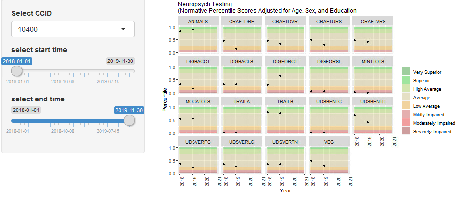

# udsnorms
Series of functions that computes and visualizes adjusted neuropsychological test scores from the Uniform Data Set (UDS) battery as described by Weintraub et al. in the original article "Version 3 of the Alzheimer Disease Center's Neuropsychological Test Battery in the Uniform Data Set (UDS)" (2018).

